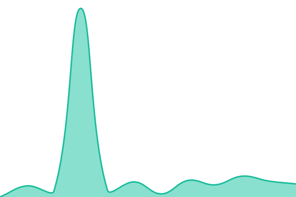
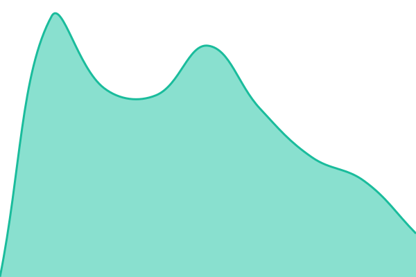
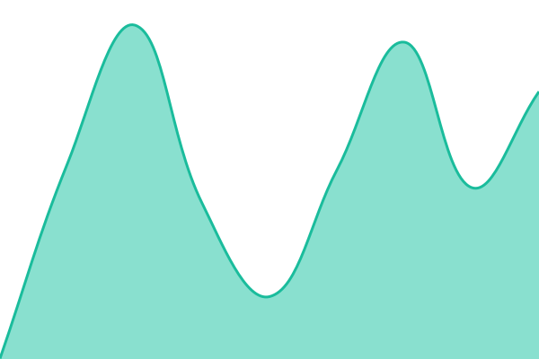
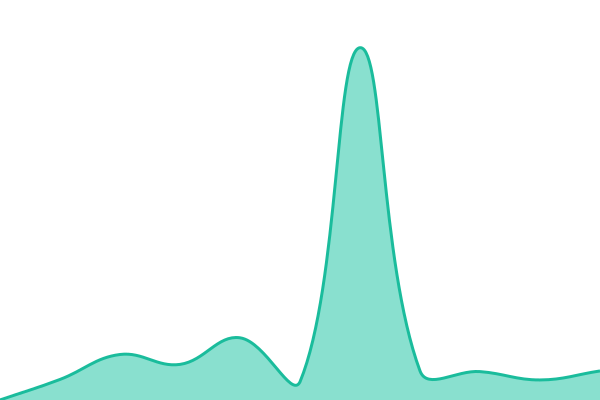

# BootForm Status

Public status page for [BootForm](https://bootform.com), published at **status.bootform.com**.

Built on [Upptime](https://github.com/upptime/upptime) - free, open-source, GitHub-powered uptime monitoring. A scheduled GitHub Action polls each endpoint below every few minutes; results publish to GitHub Pages and incident history lives as public GitHub Issues in this repo.

## [Live Status](https://status.bootform.com): <!--live status--> **🟩 All systems operational**

<!--start: status pages-->
<!-- This summary is generated by Upptime (https://github.com/upptime/upptime) -->
<!-- Do not edit this manually, your changes will be overwritten -->
<!-- prettier-ignore -->
| URL | Status | History | Response Time | Uptime |
| --- | ------ | ------- | ------------- | ------ |
|  [Form Submissions](https://f.bootform.com/status/submissions) | 🟩 Up | [form-submissions.yml](https://github.com/melenaos/Menelabs.BootForm.Status/commits/HEAD/history/form-submissions.yml) | 

 684ms
     
 | 

<a href="https://status.bootform.com/history/form-submissions">100.00%</a>
    

|  [Dashboard](https://api.bootform.com/status/dashboard) | 🟩 Up | [dashboard.yml](https://github.com/melenaos/Menelabs.BootForm.Status/commits/HEAD/history/dashboard.yml) | 

 486ms
     
 | 

<a href="https://status.bootform.com/history/dashboard">100.00%</a>
    

|  [Notification Delivery](https://delivery.bootform.com/status/delivery) | 🟩 Up | [notification-delivery.yml](https://github.com/melenaos/Menelabs.BootForm.Status/commits/HEAD/history/notification-delivery.yml) | 

 483ms
     
 | 

<a href="https://status.bootform.com/history/notification-delivery">100.00%</a>
    

|  [AI / API Access](https://mcp.bootform.com/status/mcp) | 🟩 Up | [ai-api-access.yml](https://github.com/melenaos/Menelabs.BootForm.Status/commits/HEAD/history/ai-api-access.yml) | 

 724ms
     
 | 

<a href="https://status.bootform.com/history/ai-api-access">100.00%</a>
    

<!--end: status pages-->

## What's monitored

Grouped by customer-facing impact, not by internal host or infrastructure - see [`docs/plans/16-launch-readiness-and-operations/16.02-per-component-health-circuit-breakers-and-status-page.md`](https://github.com/melenaos/Menelabs.BootForm/blob/main/docs/plans/16-launch-readiness-and-operations/16.02-per-component-health-circuit-breakers-and-status-page.md) in the main repo for the full design.

| Component                 | What it means if it's down                                                                                               |
| ------------------------- | ------------------------------------------------------------------------------------------------------------------------ |
| **Form Submissions**      | Embedded forms on customer sites can't accept new data - the most severe case                                            |
| **Dashboard**             | Customers can't log in or view submissions; forms keep accepting data independently                                      |
| **Notification Delivery** | Submissions are captured fine, but email/Discord/Slack/Telegram/webhook/Zapier/Make notifications are delayed or failing |
| **AI / API Access**       | MCP/agent integrations affected                                                                                          |

Each row polls a small dedicated `/status/*` endpoint on the relevant BootForm host, which itself rolls up real dependency health checks (database, cache, queue, etc.) and circuit-breaker state for that component's own third-party dependencies into a plain `200`/`503`.

## Configuration

All monitoring config lives in [`.upptimerc.yml`](.upptimerc.yml). Don't edit anything under `.github/workflows/` directly - those are generated by Upptime's own template updater; change the config instead. See [Upptime's docs](https://upptime.js.org/docs/configuration) for the full config reference.
